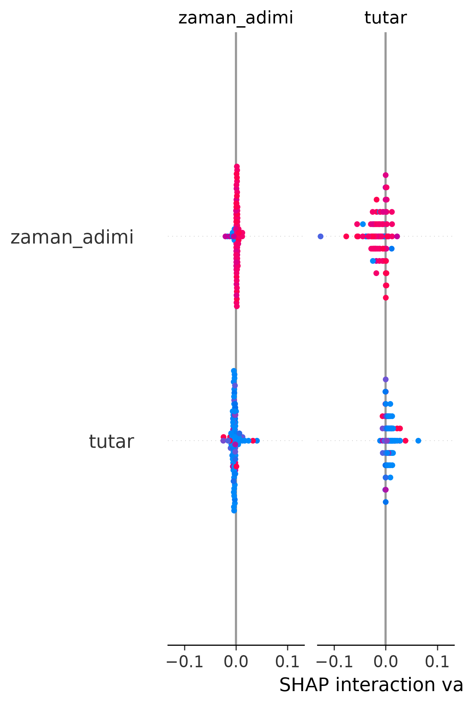

# Finansal Dolandırıcılık Tespit Sistemi
Proje Sunum Videosu: [https://youtu.be/RaBB8q8hLBg](https://youtube.com/...)

# Finansal İşlemlerde Dolandırıcılık Tespiti (Fraud Detection)

Bu proje, finansal işlemler (para transferleri, ödemeler vb.) üzerinden makine öğrenmesi algoritmaları kullanarak dolandırıcılık (fraud) faaliyetlerini tespit etmeyi amaçlamaktadır.

## 📌 Proje Özeti
Projede 100.000 satırlık sentetik finansal işlem verisi kullanılmış olup; veri ön işleme, model eğitimi ve model açıklanabilirliği adımları uçtan uca uygulanmıştır.

- **Kullanılan Algoritma:** Random Forest Classifier (Rastgele Orman)
- **Model Doğruluk Oranı (Accuracy):** %99.95

## 🚀 Kullanılan Teknolojiler
- **Programlama Dili:** Python
- **Veri Manipülasyonu:** Pandas
- **Makine Öğrenmesi:** Scikit-learn
- **Model Açıklanabilirliği (XAI):** SHAP, Matplotlib

## 🧠 Model Açıklanabilirliği (SHAP)
Yapay zeka modelinin kararlarını "kara kutu" olmaktan çıkarmak ve yorumlanabilirliğini artırmak için SHAP kütüphanesi entegre edilmiştir. Aşağıdaki grafik, modelin bir işlemin dolandırıcılık olup olmadığına karar verirken hangi özelliklere (işlem tutarı, zaman adımı, eski/yeni bakiye değişimleri vb.) dikkat ettiğini ve riskleri nasıl ağırlıklandırdığını göstermektedir.

## 📁 Proje Dosya Yapısı
- `veri_temizleme.py`: Veri setinin okunması, sütun isimlerinin düzenlenmesi ve eksik veri analizi.
- `model_egitimi.py`: Random Forest modelinin eğitilmesi ve test verisi üzerinde doğruluk oranının hesaplanması.
- `model_aciklanabilirlik.py`: SHAP değerlerinin hesaplanması ve rapor görselinin oluşturulması.
